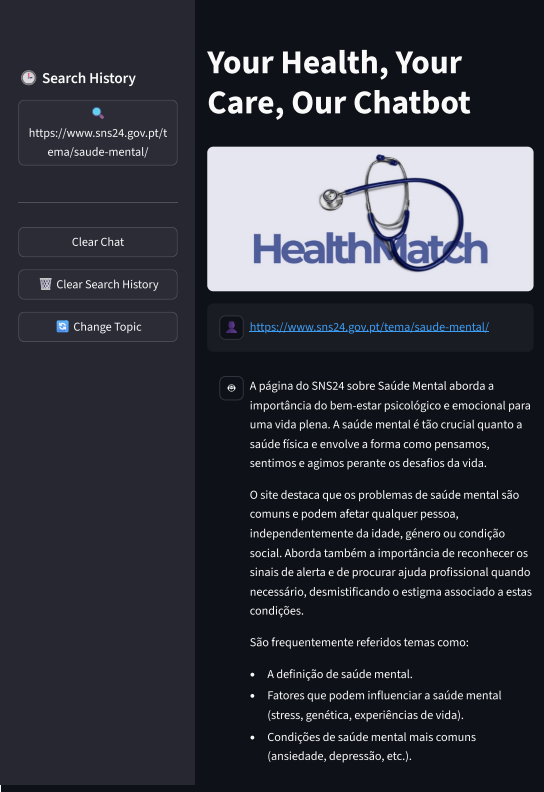
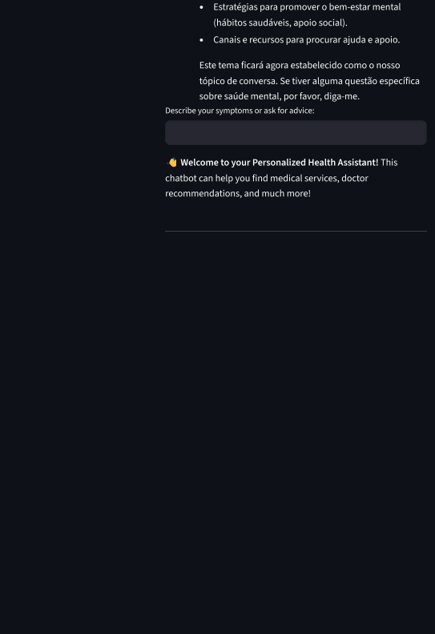

# 

Your Health, Your Care, Our Chatbot

## Overview

HealthMatch is an AI-powered health assistant chatbot designed to provide users quick and personalized medical information through natural language conversations.

The application allows users to describe symptoms, ask medical questions, or provide external URLs, and receive clear, contextualized responses grounded in medical knowledge. It is aimed at users who want quick and accessible medical information to support understanding, without replacing professional medical advice.

The project focuses on safe conversational design in healthcare, with particular
attention to topic consistency, controlled context switching and user experience.

**Target users:** General public seeking accessible medical information.


## Features

- **Conversational chatbot for medical information and symptom-related questions:** HealthMatch enables users to ask about symptoms, medical conditions, and treatments, offering accurate and specific context answers in real time. This conversational AI ensures a personalized user experience that adapts to individual needs.
- **Context-aware multi-turn conversations:** The chatbot supports multi-turn dialogues, allowing users to engage in a back and forth conversation. This feature ensures that the system retains context, which is crucial for delivering coherent responses across multiple interactions.
- **Retrieval-Augmented Generation (RAG) using a medical health dictionary:** By integrating RAG, HealthMatch uses a comprehensive medical dictionary to retrieve relevant information, grounding its responses in verified medical knowledge. This enhances the accuracy and reliability of the advice provided.
- **Semantic search with vector embeddings stored in MongoDB:** The system employs semantic search to better understand user queries and retrieve the most relevant information. By leveraging vector embeddings stored in MongoDB, HealthMatch ensures that answers are contextually relevant and semantically aligned with the user's intent.
- **Strict topic isolation to prevent unintended introduction of unrelated medical conditions:** The application maintains strict topic isolation, preventing the introduction of irrelevant medical conditions or topics. This ensures that users receive focused and accurate responses, minimizing confusion and improving the overall experience.
- **URL content analysis using Gemini URL Context tool:** HealthMatch can analyze URLs provided by users to extract relevant information and provide contextual answers. This feature allows the chatbot to reference real world sources while maintaining the integrity of the advice provided.
- **AI observability and tracing with Langfuse:** Langfuse integration allows real time monitoring and tracing of the AI's decision-making process. This feature enhances system reliability by providing valuable insights into the AI's performance and enabling quick solutions.


## Tech Stack

### **Backend:**
- **Python:** Python is the go to language for AI development due to its simplicity and versatility. It's perfect for building the backend logic of our application, integrating external APIs, and processing data efficiently. Plus, Python has a rich ecosystem of libraries that make development faster and smoother.
- **Google Gemini API:** We chose Google Gemini for its ability to generate precise and contextually aware responses.

### **Frontend:**
- **Streamlit:** Is an ideal choice for building the frontend. It allows us to quickly prototype and create a user friendly interface that interacts seamlessly with our Python backend. Streamlit is intuitive, easy to use, and perfect for showcasing our AI chatbot, making it accessible to all users without needing advanced development skills.

### **Database:**
- **MongoDB:** We used MongoDB because of it is great for storing semi-structured data, such as medical information like diseases, symptoms, treatments and health suggestions.

### **AI/ML:**
- **Google Gemini LLM:** The Gemini LLM powers the core of our chatbot. It is capable of understanding and responding to medical queries with high accuracy and by integrating Gemini, we can ensure that users receive reliable and contextually relevant information based on their questions.
- **LangChain Google Generative AI Embeddings:** LangChain is integrated to work with the Google Generative AI Embeddings, enhancing the AI's understanding of the user's input. It helps us better handle the context behind the queries, improving the chatbot's overall performance.
- **MongoDB Vector Search:** We use MongoDB's vector search to perform semantic search, enabling the chatbot to match user queries with the most relevant medical data. This makes responses more aligned with what the user is asking, ensuring, once again, higher accuracy.
- **Langfuse for observability:** Langfuse allows us to monitor and trace the AI's performance in real-time. By tracking each interaction, we can quickly identify issues, improve prompts, and ensure that the chatbot provides reliable and accurate medical recommendations.

## Architecture

The application follows a layered architecture with clear separation of concerns:

- **UI Layer:** Streamlit interface for user interaction and chat display.

**Responsibility:** The UI Layer is where users interact with the chatbot. It provides an easy-to-use interface for users to input their queries, whether it's describing symptoms, asking medical questions, or sharing URLs.
**Technology:** Built using Streamlit, this layer is designed to be simple and intuitive, ensuring an accessible user experience. The UI displays both the user's input and the responses generated by the AI system.
**How it works:** Once a user enters a query, it's sent to the Service Layer for processing, and the response is then displayed back to the user in the chat interface.


- **Service Layer:** Application logic handling user input, context management, and orchestration.

**Responsibility:** The Service Layer acts as the "middleman" between the UI and the AI/Data layers. It manages user requests, retrieves necessary data, and orchestrates the flow of information.
**How it works:** When a user submits a query, the API Layer: receives the request from Streamlit; retrieves structured data from MongoDB if necessary (medical information like specialties, doctors, and exams); sends the query along with any relevant context (like past messages or symptoms) to the AI Layer for further processing; returns the generated response from the AI Layer to the UI Layer.


- **AI Layer:** Gemini LLM for response generation combined with RAG for grounded answers.

**Responsibility:** The AI Layer is the core of the HealthMatch system. It is responsible for processing user queries, generating responses, and ensuring the answers are grounded in reliable, context-aware information.
**How it works:** The RAG (Retrieval-Augmented Generation) component retrieves relevant data from the hospital's internal documents, such as the health dictionary. The Google Gemini LLM processes the query and combines it with the retrieved context to generate a natural, accurate response. This combination of retrieval (to get relevant documents) and generation (to form responses) ensures the answers are both precise and reliable.

- **Data Layer:** MongoDB storing medical documents and vector embeddings.

**Responsibility:** The Data Layer stores all structured medical information, including details about specialties, exams, doctors, and locations. This layer serves as the primary data source for the chatbot.
**Technology:** MongoDB is used for storing flexible and scalable datasets, while CSV files can be used for lightweight data storage. This layer enables the API Layer to access up-to-date medical information and support the chatbot's functionality.
**How it works:** When the API Layer requests information, the data is fetched from MongoDB or CSV files, depending on the system's needs.


### **Data Flow Across the System:**
- User submits a query: The user inputs a question or describes their symptoms via the Streamlit interface.
- Request to Service Layer: The query is sent to the Service Layer for processing.
- Data retrieval: The Service Layer may query MongoDB for relevant medical data (like specialties or exams) to support the query.
- RAG retrieves context: The RAG component fetches additional context from internal documents, such as a medical dictionary.
- Response generation: The Gemini LLM processes the user's query and the context to generate an accurate and natural response.
- Final response to user: The response is sent back to Streamlit, where it's displayed to the user in the chat interface.

An architecture diagram and further explanation can be found in docs/ARCHITECTURE.md.

## Installation & Setup

### Prerequisites
- Python 3.x
- MongoDB with Vector Search enabled
- API keys for Google Gemini and Langfuse

### Installation Steps

1. Clone the repository:
```bash
git clone https://github.com/Carlotavfsilva/capstone_project-HealthMatch
cd capstone_project-HealthMatch
```

2. Install dependencies:
```bash
uv sync
```

**Required environment variables:**
This application uses Streamlit Secrets for configuration.

Create a `.streamlit/secrets.toml` file with the following structure:

```
[GOOGLE_API_KEY]
key = "your_gemini_api_key"

[MONGODB_URI]
uri = "your_mongodb_uri"

[LANGFUSE]
public_key = "your_langfuse_public_key"
secret_key = "your_langfuse_secret_key"
host = "https://cloud.langfuse.com"
```

4. Run the application:
```bash
uv run streamlit run app.py
```

## Usage

1. Open the HealthMatch web application.
2. Enter a health-related question or describe symptoms in natural language.
3. Optionally paste a health-related URL for contextual analysis.
4. Receive a grounded response supported by the medical knowledge base.
5. Ask follow-up questions in the same conversation.

**Example queries:**
- "Tenho dores no peito e falta de ar, o que pode ser?"
- "Qual a diferença entre gripe e constipação?"
- "Resume esta página médica: [URL]"


## Example Conversations

The following screenshots illustrate the chatbot’s behaviour in real usage scenarios,
including topic consistency, preventive care guidance and user-friendly interaction.

### Friendly greeting


### General preventive care (pregnancy)


### Topic consistency and self-care


### URL interaction



## Deployment

**Live Application:** https://capstoneproject-healthmatch-paduu3ojfl7cbzj62y5kue.streamlit.app

**Status:** The application is deployed on Streamlit Cloud and can be accessed publicly without authentication.  

**Deployment Platform:** Streamlit Cloud


## Project Structure

```
project-root/
├── app.py                 # Main application entry point
├── services/              # Business logic layer
├── tools/                 # Function calling tools
├── utils/                 # Utility functions
├── docs/
│   └── ARCHITECTURE.md    # Architecture decisions and explanations
├── requirements.txt       # Dependencies
└── README.md              # This file
```


## Limitations & Disclaimer

- **No Medical Diagnoses:** HealthMatch is a tool designed to provide general medical information and assist with symptom understanding. It does not replace professional medical advice, diagnosis, or treatment.
- **Limited Scope:** The application is focused on providing information related to specific symptoms, medical specialties, and available services. It does not provide personalized treatment plans or specific medical diagnoses.
- **Data Accuracy:** While HealthMatch uses up-to-date medical knowledge and reliable sources, the information provided may not always reflect the latest research or specific individual health conditions. Users should always consult a healthcare professional for a diagnosis or treatment.
- **Privacy and Data Usage:** HealthMatch does not store any personal health data or sensitive information. All user interactions are anonymized, and the system prioritizes data privacy and security.
  

## Future Work

- **Integration with Hospital Systems:** Future work will focus on integrating HealthMatch with the hospital's internal systems, allowing the chatbot to provide real time updates on doctor availability, appointment scheduling, and medical history.
- **Enhanced Symptom Triage Logic:** The symptom triage logic will be refined to provide more accurate recommendations, incorporating feedback from users and medical professionals to improve its reliability.
- **Multilingual Support:** Adding support for multiple languages will increase the accessibility of HealthMatch, allowing it to serve a wider audience and support patients in different regions.
- **Improved Context Handling:** Future iterations will enhance the system's ability to handle more complex conversations, ensuring a smoother and more dynamic user experience.
- **Advanced Features:** Potential future features may include the integration of multimodal processing (such as image recognition for medical conditions) and voice interaction, expanding the capabilities of the chatbot.
- **Expanded Information Access:** To further enhance the user experience, just as we wanted in the Technical Report, HealthMatch could be expanded to provide more detailed information, including profiles of healthcare professionals, specialties associated with each doctor, real-time appointment scheduling, estimated waiting times at different hospitals, and up-to-date news about the hospitals' services and developments. This would create a comprehensive healthcare assistant, providing users with all the information they need in one place, making it even more valuable and time-saving.


## License

This project is intended for **academic purposes** only. It is not for **commercial use**. The source code is provided "as is," and no warranties or guarantees are made regarding its accuracy or functionality.


## Team

- **Carlota Fradinho e Silva, Project Management, Documentation, UI**: Carlota leads the project, managing timelines, ensuring that all tasks are completed, and coordinating communication between the team members. She is also responsible for writing documentation and ensuring the user interface is intuitive and user-friendly.
- **Gonçalo Morais, Backend Development, UI Support:** Gonçalo focuses on the backend development of the project, integrating the AI model and ensuring smooth communication between the system's components. He also provides support for the frontend, ensuring that the UI works seamlessly with the backend.
- **Gonçalo Palhoto, Technical Architecture, Research, Medical Content:** Gonçalo is responsible for designing the technical architecture of the system and leading the research efforts, ensuring the medical content is accurate and up-to-date. He plays a crucial role in integrating the medical data sources and AI model.

---