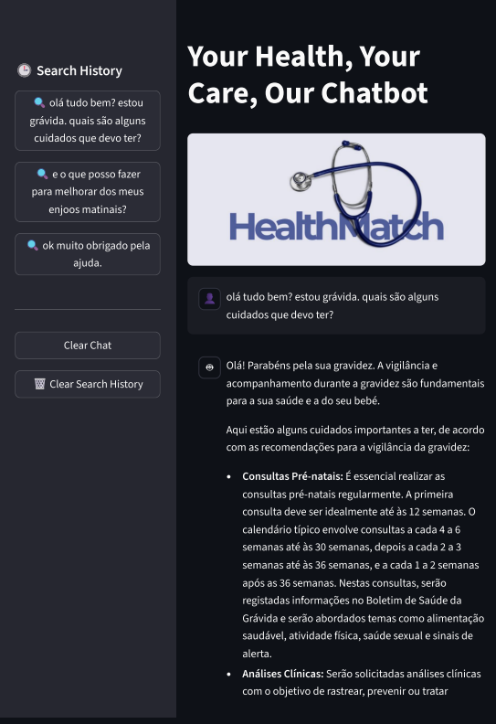
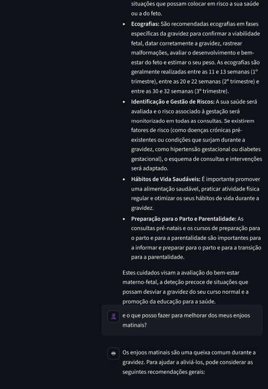
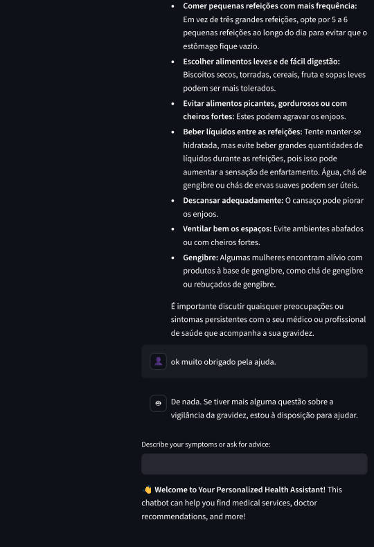

# HealthMatch

Your Health, Your Care, Our Chatbot

## Overview

HealthMatch is an AI-powered conversational health assistant designed to help users understand medical conditions and access relevant health-related information through natural language interaction.

The application allows users to describe symptoms, ask medical questions, or provide external URLs, and receive clear, contextualized responses grounded in medical knowledge. It is aimed at users who want quick and accessible medical information
to support understanding, without replacing professional medical advice.

The project focuses on safe conversational design in healthcare, with particular
attention to topic consistency, controlled context switching and user experience.

**Target users:** General public seeking accessible medical information.


## Features

- Conversational chatbot for medical information and symptom-related questions.
- Context-aware multi-turn conversations.
- Retrieval-Augmented Generation (RAG) using a medical health dictionary.
- Semantic search with vector embeddings stored in MongoDB.
- Strict topic isolation to prevent unintended introduction of unrelated medical conditions.
- URL content analysis using Gemini URL Context tool.
- AI observability and tracing with Langfuse.

## Tech Stack

**Backend:**
- Python
- Google Gemini API

**Frontend:**
- Streamlit

**Database:**
- MongoDB

**AI/ML:**
- Google Gemini LLM
- LangChain Google Generative AI Embeddings
- MongoDB Vector Search
- Langfuse for observability

## Architecture

The application follows a layered architecture with clear separation of concerns:

- UI Layer: Streamlit interface for user interaction and chat display.
- Service Layer: Application logic handling user input, context management, and orchestration.
- AI Layer: Gemini LLM for response generation combined with RAG for grounded answers.
- Data Layer: MongoDB storing medical documents and vector embeddings.

An architecture diagram and further explanation can be found in docs/ARCHITECTURE.md.

## Installation & Setup

### Prerequisites
- Python 3.x
- MongoDB with Vector Search enabled
- API keys for Google Gemini and Langfuse

### Installation Steps

1. Clone the repository:
```bash
git clone https://github.com/Carlotavfsilva/capstone_project-HealthMatch
cd capstone_project-HealthMatch
```

2. Install dependencies:
```bash
uv sync
```

**Required environment variables:**
This application uses Streamlit Secrets for configuration.

Create a `.streamlit/secrets.toml` file with the following structure:

```
[GOOGLE_API_KEY]
key = "your_gemini_api_key"

[MONGODB_URI]
uri = "your_mongodb_uri"

[LANGFUSE]
public_key = "your_langfuse_public_key"
secret_key = "your_langfuse_secret_key"
host = "https://cloud.langfuse.com"
```

4. Run the application:
```bash
uv run streamlit run app.py
```

## Usage

1. Open the HealthMatch web application.
2. Enter a health-related question or describe symptoms in natural language.
3. Optionally paste a health-related URL for contextual analysis.
4. Receive a grounded response supported by the medical knowledge base.
5. Ask follow-up questions in the same conversation.

**Example queries:**
- "Tenho dores no peito e falta de ar, o que pode ser?"
- "Qual a diferença entre gripe e constipação?"
- "Resume esta página médica: [URL]"

## Example Conversations

The following screenshots illustrate the chatbot’s behaviour in real usage scenarios,
including topic consistency, preventive care guidance and user-friendly interaction.

### Friendly greeting


### General preventive care (pregnancy)


### Topic consistency and self-care


## Deployment

**Live Application:** https://capstoneproject-healthmatch-paduu3ojfl7cbzj62y5kue.streamlit.app

**Status:** The application is deployed on Streamlit Cloud and can be accessed publicly without authentication.  

**Deployment Platform:** Streamlit Cloud

## Project Structure

```
project-root/
├── app.py                 # Main application entry point
├── services/              # Business logic layer
├── tools/                 # Function calling tools
├── utils/                 # Utility functions
├── docs/
│   └── ARCHITECTURE.md    # Architecture decisions and explanations
├── requirements.txt       # Dependencies
└── README.md              # This file
```

## Limitations & Disclaimer

- HealthMatch does not provide medical diagnoses.
- The application does not replace professional medical advice.
- Responses are informational and based on available documents.
- No personal health data is stored.
- The system prioritizes safety and topic consistency, which may occasionally result
  in conservative or high-level responses.
  
## Future Work

- Integration with hospital information.
- Improved symptom triage logic.
- Multilingual support.
- Better context handling.

## License

This project is for academic purposes.

## Team

- Carlota Fradinho e Silva – Project Management, Documentation, UI
- Gonçalo Morais – Backend Development, UI Support
- Gonçalo Palhoto – Technical Architecture, Research, Medical Content

---