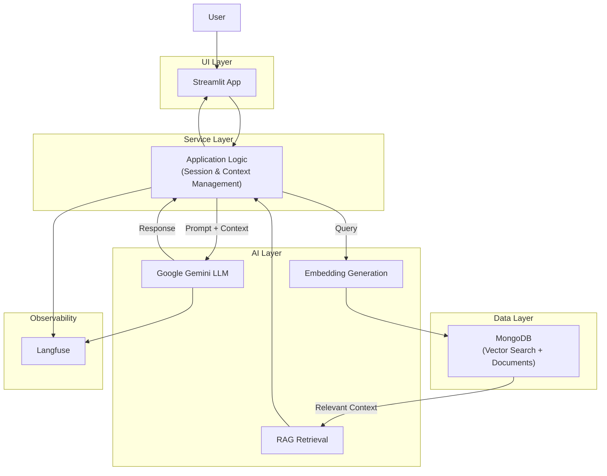

# System Architecture

## Overview
HealthMatch follows a layered architecture that separates user interaction, application logic, AI reasoning, and data storage.  
This design improves clarity, maintainability, and allows future extensions without impacting the full system.

## Architecture Diagram

## Layers

### UI Layer
- Streamlit-based interface
- Handles user input and chat presentation
- No business logic or AI reasoning

### Service Layer
- Orchestrates application logic
- Manages conversation state and context
- Coordinates AI calls and data retrieval

### AI Layer
- Google Gemini LLM for response generation
- Prompt logic to enforce topic consistency
- RAG mechanism for medical context grounding

### Data Layer
- MongoDB for medical documents and embeddings
- Vector search used for semantic retrieval

## Data Flow
1. User submits a query via Streamlit  
2. Service layer determines whether the query requires RAG retrieval, URL analysis, or direct LLM reasoning  
3. Relevant medical context is retrieved if necessary  
4. Gemini generates a response using the constructed prompt  
5. Response is returned to the UI  

## Key Design Decisions
- Layered architecture to enforce separation of concerns  
- RAG used instead of model fine-tuning for domain grounding  
- MongoDB Vector Search to keep data storage and retrieval unified  
- Langfuse integrated for full observability of AI behavior  

## Observability
All AI interactions are traced using Langfuse, enabling debugging, monitoring, and prompt evaluation.